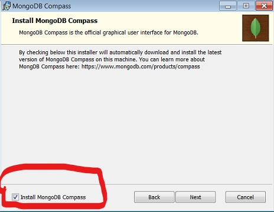

# Flask 
<p>6627 favorite framework</p>

## Prerequisites

### Software
- <a href="https://www.postman.com/downloads/">Postman</a>
- <a href = "https://www.python.org/downloads/">Python 3</a>
- <a href = "https://www.jetbrains.com/pycharm/download/">Pycharm</a>
- <a href = "https://www.mongodb.com/try/download/enterprise">MongoDB</a>

### Installing MongoDB
1. Follow the MongoDB link listed above
2. choose your OS
3. Select the latest version
4. Click 'Download'
5. Follow the steps in the set up wizard 
    - make sure "Install MongoDB Compass" is checked



### Installing Flask
#### Via Linux terminal
```shell
$ sudo apt-get install python3-pip
$ sudo pip3 install flask
$ sudo pip3 install flask-cors
```

#### Via Pycharm
1. Ctrl + Alt + s -> Project Interpreter
2. Click on the '+' icon to install software
3. Search 'flask' and install it


## Starter Code
```python
from flask import *
from flask_cors import *

# runtime configurations
HOST = 'localhost'
PORT = 5000

app = Flask(__name__)

@app.route('/', methods=['GET'])
def index():
    return "hello world"

def main():
    CORS(app)
    app.debug = True
    app.run(HOST, PORT)

main()
```
## Important Concepts
### Basics
```python
# foo will execute if a GET or POST request is made with 'pancakes' in the URL
# 1st argument: route name. 2nd argument: API requests 
@app.route('/pancakes', methods=['GET', 'POST']) 
def foo(): # EX: http://localhost:5000/pancakes
    return "pancake jokes are so flat"
# functions decorated w/ @app.route CAN ONLY return the following...
# - string (HTML)
# - dictionary (JSON)
# - tuple
# - Response instance
# - WSGI callable
```

### Path Variable
```python
# to inject a path variable, use '<>'
# argument name in foo must match argument name in app.route
# in foo, 'key' is our path variable that we substitute in the URL
@app.route('/computers/<key>', methods=['GET'])
def foo(key):  # EX: http://localhost:5000/computers/windows
    table = \
        {
            "chromebook": "terrible",
            "mac": "good but too expensive",
            "pc": "amazing"
        }
    return {key: table[key]}

# you can also inject multiple path variables
# make sure the names in '<>' in app.route match the functions argument ver batim
@app.route('/company/<arg0>/<arg1>', methods=['GET'])
def bar(arg0, arg1):  # EX: http://localhost:5000/company/shantanu/infosys
    return f"Hello My name is {arg0}, I work at {arg1}"
```

### Loading JSON request body
```python
@app.route('/', methods=['GET'])
def foo():
    # THIS SNIPPET IS REQUIRED TO LOAD JSON DATA
    obj = request.get_json() 
    return obj
```
