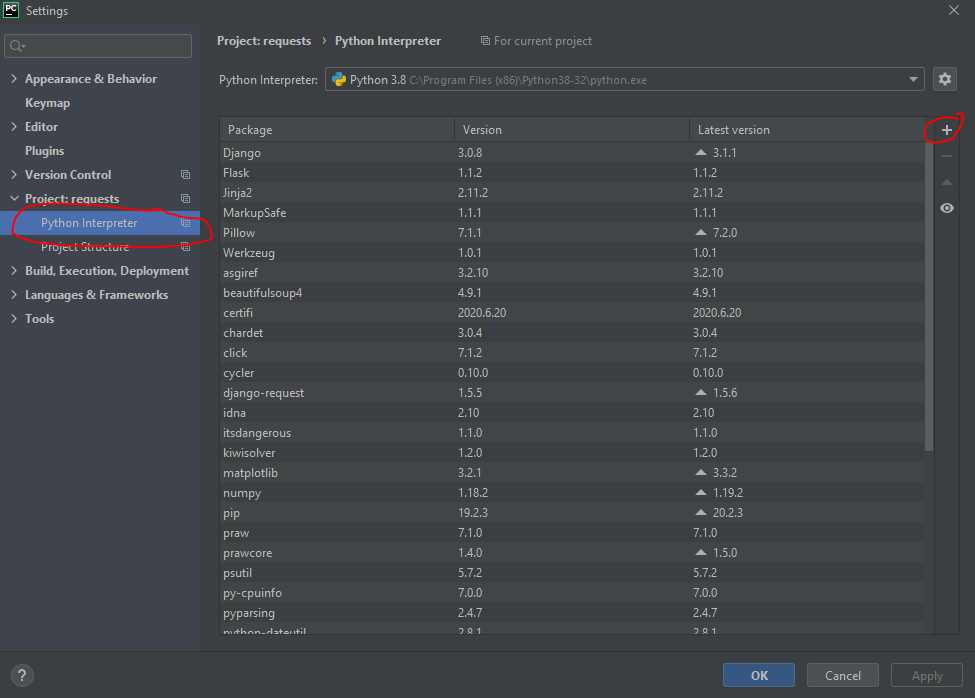
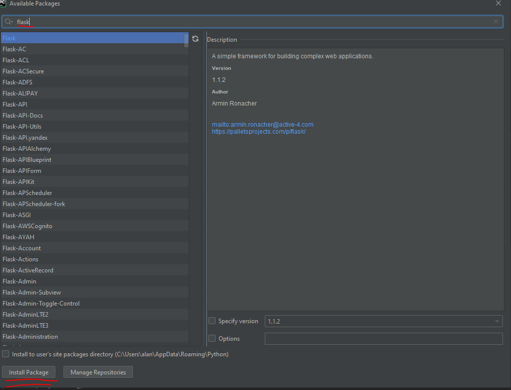

# Flask 

## Prerequisites
### Software
- <a href="https://www.postman.com/downloads/">Postman</a>
- <a href = "https://www.python.org/downloads/">Python 3</a>
- <a href = "https://www.jetbrains.com/pycharm/download/">Pycharm</a>
### Installing Flask
#### Via terminal
```shell script
$ sudo apt-get install python3-pip
$ sudo pip3 install flask
```

#### Via Pycharm
1. Ctrl + Alt + s -> Project Interpreter
2. Click on the '+' icon to install software
3. Search 'flask' and install it





## Starter Code
```python
from flask import *

# runtime configurations
HOST = 'localhost'
PORT = 5000

app = Flask(__name__)

@app.route('/', methods=['GET'])
def index():
    return "hello world"

def main():
    app.debug = True
    app.run(HOST, PORT)

main()
```